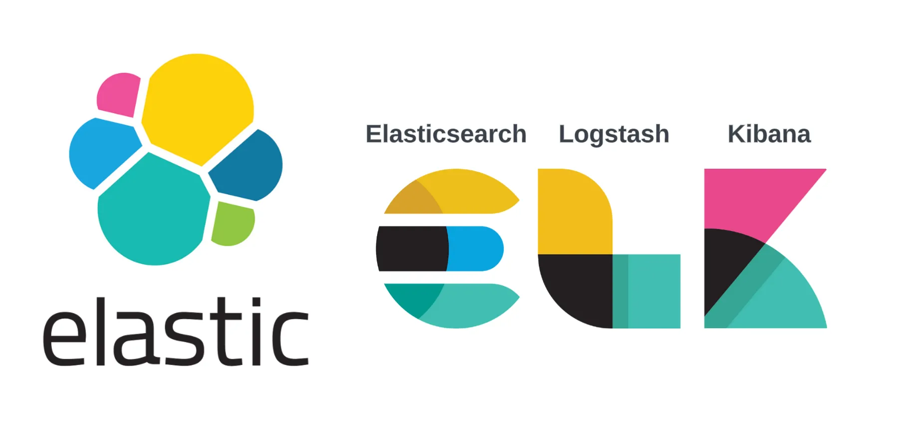
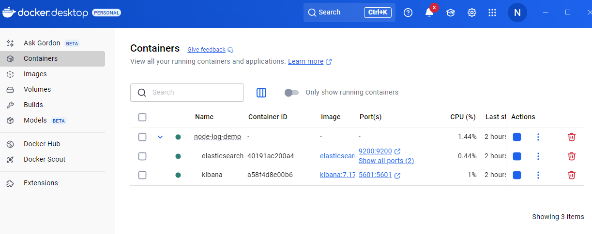
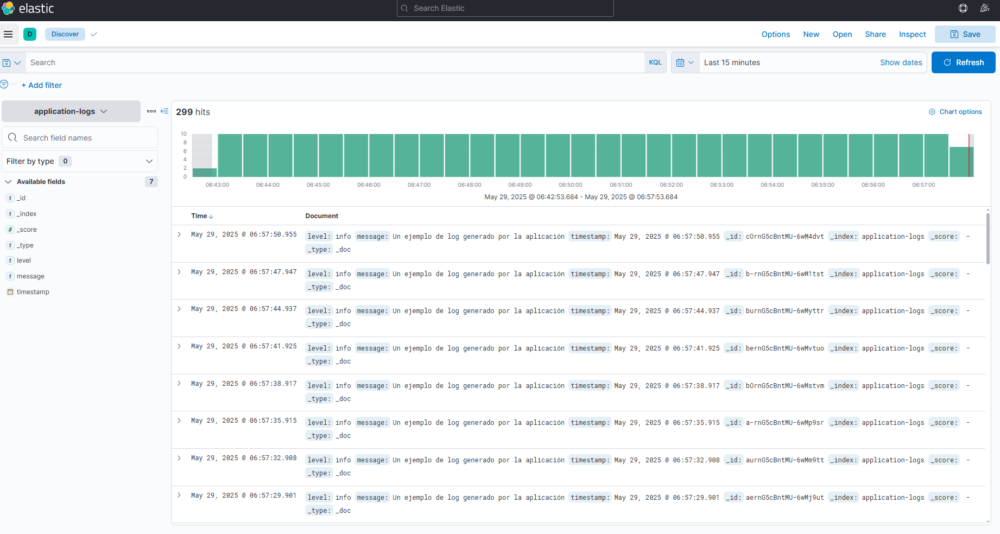

# Monitoreo de Aplicaciones con ELK Stack y Node.js



## 1. Introducción

El monitoreo de aplicaciones es fundamental para garantizar el funcionamiento óptimo y la disponibilidad de los sistemas en tiempo real. Permite a desarrolladores y administradores identificar problemas, analizar el rendimiento y optimizar recursos. Entre los principales beneficios del monitoreo se encuentran:

- **Detección temprana de fallos** antes de que impacten a los usuarios.
- **Mejora del rendimiento** de la aplicación y la infraestructura.
- **Análisis proactivo** para la toma de decisiones y optimización del código.

Los logs de aplicaciones son una herramienta clave para el monitoreo, ya que registran eventos, errores y el comportamiento de la aplicación a lo largo del tiempo.

---

## 2. ¿Qué son los Logs?

Un **log** es un registro de eventos generado por una aplicación o sistema. Estos archivos contienen información detallada sobre el funcionamiento interno, incluyendo errores, advertencias y eventos relevantes.

### Tipos de logs más comunes:

- `INFO`: Información sobre el funcionamiento normal.
- `WARN`: Advertencias sobre posibles incidencias.
- `ERROR`: Errores que afectan la operación de la aplicación.

**Ejemplo de log:**
```
2025-05-29T14:32:00 [INFO] Usuario conectado: id=1234
2025-05-29T14:32:10 [ERROR] Error al conectar con la base de datos.
```
---

## 3. Importancia del Almacenamiento y Análisis de Logs

Almacenar y analizar logs es esencial para obtener visibilidad sobre el estado de la aplicación. El análisis de logs permite:

- Detectar patrones y errores recurrentes.
- Mejorar la estabilidad y el rendimiento.
- Identificar problemas en tiempo real y actuar rápidamente.

---

## 4. Introducción a ELK Stack

**ELK Stack** es un conjunto de herramientas de código abierto ampliamente utilizado para la gestión y visualización de logs:

- **Elasticsearch:** Motor de búsqueda y análisis distribuido para almacenar y consultar grandes volúmenes de datos.
- **Logstash:** Herramienta para procesar, transformar y enviar datos desde diversas fuentes hacia Elasticsearch.
- **Kibana:** Plataforma de visualización que permite explorar y analizar los datos almacenados en Elasticsearch.

### Ventajas de ELK Stack

- **Escalabilidad:** Manejo eficiente de grandes volúmenes de datos.
- **Flexibilidad:** Integración con múltiples fuentes y tipos de datos.
- **Visualización en tiempo real:** Dashboards y análisis interactivos con Kibana.

---

## 5. Flujo de Datos en ELK Stack

El flujo típico de datos en una solución basada en ELK Stack es el siguiente:

1. **Generación de logs:** La aplicación produce logs en tiempo real.
2. **Procesamiento con Logstash:** Los logs se recogen y procesan antes de enviarse a Elasticsearch.
3. **Almacenamiento en Elasticsearch:** Los datos se indexan y almacenan para búsquedas rápidas.
4. **Visualización en Kibana:** Los usuarios exploran y analizan los logs mediante dashboards y filtros.

---

## 6. Arquitectura de la Solución

La solución propuesta incluye los siguientes componentes:

- **Aplicación Node.js:** Genera logs de ejemplo cada 3 segundos, incluyendo timestamp, nivel de severidad y mensaje.
- **Envío de logs a Elasticsearch:** Utiliza el cliente oficial de Elasticsearch para Node.js, almacenando los logs en el índice `application-logs`.
- **Visualización en Kibana:** Permite buscar, filtrar y visualizar los logs a través de la interfaz gráfica.

---

## 7. Proceso de Monitoreo con ELK Stack

El proceso de monitoreo se compone de los siguientes pasos:

1. Generación de logs en la aplicación.
2. Envío de logs a Elasticsearch mediante Logstash o el cliente oficial.
3. Visualización en tiempo real con Kibana.
4. Búsqueda y filtrado de logs por criterios específicos.
5. Análisis de datos para identificar cuellos de botella, errores y problemas de rendimiento.

El uso de ELK Stack facilita la gestión centralizada de logs, permitiendo una supervisión eficiente y la toma de decisiones informadas.

---

## Consideraciones Técnicas: Instalación y Comandos

### 1. Instalación de Docker y Docker Compose

Para desplegar Elasticsearch y Kibana con Docker, primero instala Docker Desktop:

- [Descargar Docker Desktop](https://www.docker.com/products/docker-desktop/)

Verifica la instalación ejecutando:
```bash
docker --version
docker-compose --version
```

---

### 2. Configuración de la Aplicación Node.js

#### Paso 1: Inicializar el proyecto

```bash
mkdir node-log-demo
cd node-log-demo
npm init -y
```

#### Paso 2: Instalar dependencias

```bash
npm install winston @elastic/elasticsearch
```
- `winston`: Generación de logs.
- `@elastic/elasticsearch`: Cliente oficial para Node.js.

#### Paso 3: Crear el archivo `app.js`

Implementa la lógica para generar y enviar logs a Elasticsearch.

#### Paso 4: Ejecutar la aplicación

```bash
node app.js
```

---

### 3. Configuración de Elasticsearch y Kibana con Docker Compose

#### Paso 1: Crear `docker-compose.yml`

```yaml
version: '3'
services:
    elasticsearch:
        image: docker.elastic.co/elasticsearch/elasticsearch:7.17.17
        environment:
            - discovery.type=single-node
        ports:
            - "9200:9200"
        volumes:
            - esdata:/usr/share/elasticsearch/data
    kibana:
        image: docker.elastic.co/kibana/kibana:7.17.17
        ports:
            - "5601:5601"
        depends_on:
            - elasticsearch

volumes:
    esdata:
        driver: local
```

#### Paso 2: Levantar los servicios


```bash
docker-compose up -d
```

#### Paso 3: Verificar contenedores activos




```bash
docker ps
```

#### Paso 4: Acceder a Kibana

Abre [http://localhost:5601](http://localhost:5601) en tu navegador. Crea un patrón de índice para `application-logs*` y comienza a visualizar los logs.

---

### 4. Visualización de Logs en Kibana




- Accede a la sección **Discover** en Kibana.
- Crea un patrón de índice para `application-logs*`.
- Visualiza, filtra y analiza los logs generados por la aplicación Node.js.

---

## Resumen de Comandos

```bash
# Inicializar proyecto Node.js
npm init -y
npm install winston @elastic/elasticsearch

# Levantar contenedores
docker-compose up -d

# Verificar contenedores
docker ps

# Ejecutar la aplicación Node.js
node app.js
```


---

## Conclusión

Esta guía proporciona los pasos necesarios para implementar un entorno de monitoreo de logs utilizando Docker, Elasticsearch, Kibana y Node.js. La solución es escalable y flexible, permitiendo la generación, almacenamiento y visualización eficiente de logs. Aunque la implementación aquí presentada es básica y orientada a demostraciones, puede adaptarse fácilmente a entornos de producción incorporando seguridad, alertas y optimización de rendimiento.

---

## Referencias

- [Node.js](https://nodejs.org)
- [Winston (npm)](https://www.npmjs.com/package/winston)
- [Elasticsearch Node.js Client](https://www.elastic.co/guide/en/elasticsearch/client/javascript-api/current/index.html)
- [Elasticsearch](https://www.elastic.co/elasticsearch)
- [Kibana](https://www.elastic.co/kibana)
- [Docker Desktop](https://www.docker.com/products/docker-desktop)
- [Docker Compose](https://docs.docker.com/compose/)
- [Logstash](https://www.elastic.co/logstash)
- [Elastic Stack](https://www.elastic.co/what-is/elastic-stack)
- [Seguridad en Elasticsearch](https://www.elastic.co/guide/en/elasticsearch/reference/7.17/security-minimal-setup.html)
- [Elasticsearch en Docker](https://www.elastic.co/guide/en/elasticsearch/reference/7.17/docker.html)
