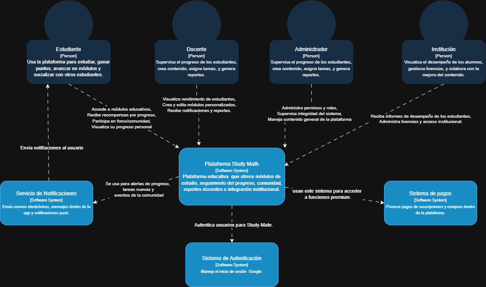

# 5.1. Contexto
A continuación, se muestra el diagrama de contexto del aplicativo web Study Math:

## Actores

- **Estudiante**: Usa la plataforma para estudiar, ganar puntos, avanzar en módulos y socializar con otros estudiantes.
- **Docente**: Supervisa el progreso de los estudiantes, crea contenido, asigna tareas, y genera reportes.
- **Administrador**: Administra permisos y roles,Supervisa integridad del sistema,Maneja contenido general de la plataforma
- **Institución**: Visualiza el desempeño de los alumnos, gestiona licencias, y colabora con la mejora del contenido.

## Sistema Central

- **Plataforma Study Math**: Plataforma educativa  que ofrece módulos de estudio, seguimiento del progreso, comunidad, reportes docentes e integración institucional.

## Sistemas Externos

- **Sistema de pagos**: Procesa pagos de suscripciones y compras dentro de la plataforma.
- **Servicio de Notificaciones**: Envía correos electrónicos, mensajes dentro de la app y notificaciones push..
- **Sistema de Autenticación**: Maneja el inicio de sesión  Google.